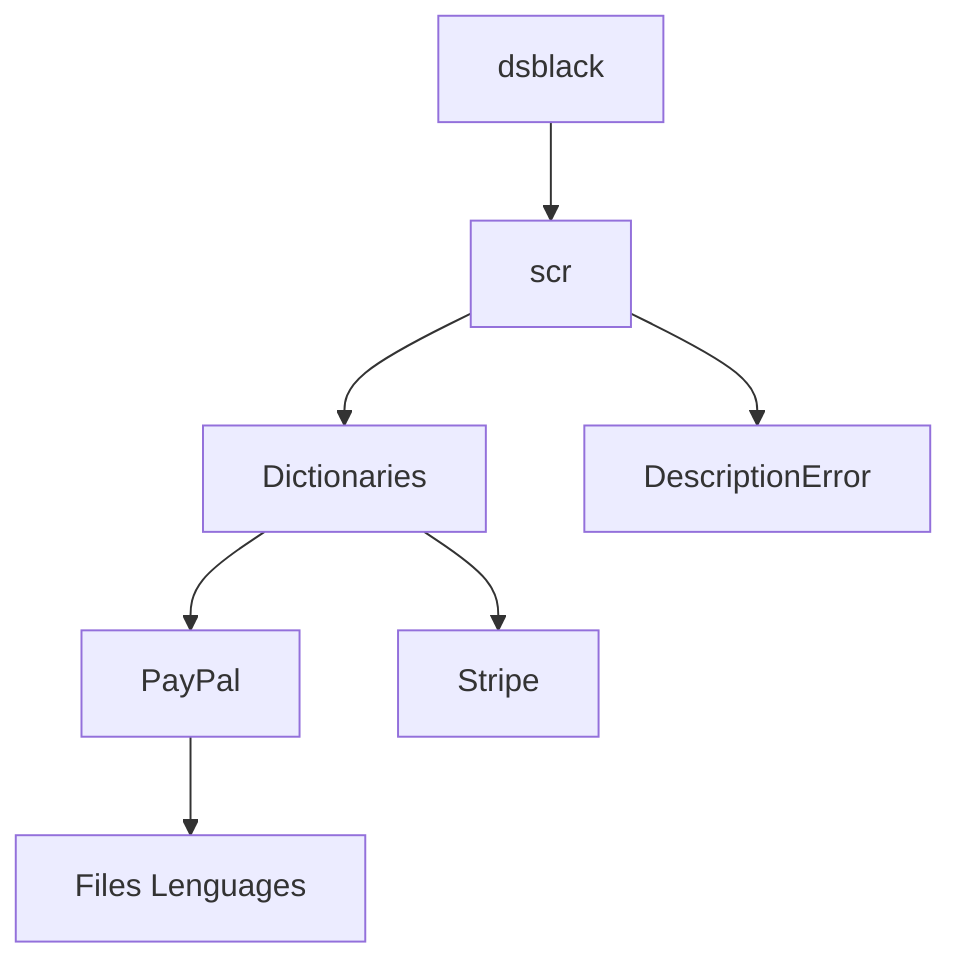

# DsError
show description of the error responses, for the use of webcomers who use online payment and do not have an error interpreter, this to facilitate the user's resolution of the problem

Supported APIs

* [PayPal](https://github.com/BlackByted/DsError/wiki/PayPal-Soported)
* [Stripe](https://github.com/BlackByted/DsError/wiki/Stripe-Soported)

# Instalacion

## Composer

### Instruction

1. Download [Composer](https://getcomposer.org/download/) if not already installed
2. Go to your project directory

> $ Cd current_project

3. execute composer require dsblack/dserror
```
$ composer require dsblack/dserror
#Output:
  Info from https://repo.packagist.org: #StandWithUkraine
  Using version dev-main for dsblack/dserror
  ./composer.json has been updated
  Running composer update dsblack/dserror
  Loading composer repositories with package information
```

4. Ready, you would already have DsError, the structure within your project would be:



## Direct Download

### Instruction

1 Download the latest zip with the help of github


2 Go to your project directory

> $ Cd current_project

3 Unzip, and copy directory to your project location

4 Ready, you would already have DsError, the structure within your project would be:


# Lenguages Soported

currently there is support for 4 languages, English, Español, Deuch, French with their respective acronyms/identifiers that are used as a parameter to display the error description

## languages ​​and APIs with their dictionary

| Lenguge | PayPal | Stripe |
| :---: | :---: | :---: |
| English (en) |✔️|✔️|
| Español (es) |✔️|✔️|
| Deuch (de)   |❌|✔️|
| French (fr)  |❌|✔️|
